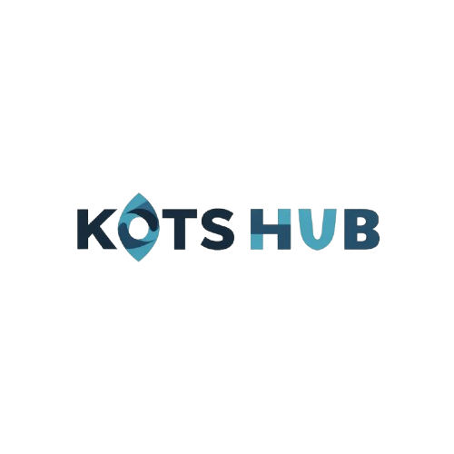

# KotsHub - Boarding House Booking Platform



Aplikasi web modern untuk mencari, melihat, dan memesan kos (boarding house) dengan mudah. Dibangun dengan Laravel 11, Filament Admin Panel, dan Tailwind CSS.

## 📋 Daftar Isi

- [Fitur Utama](#fitur-utama)
- [Tech Stack](#tech-stack)
- [Struktur Project](#struktur-project)
- [Instalasi](#instalasi)
- [Konfigurasi](#konfigurasi)
- [Penggunaan](#penggunaan)
- [API Documentation](#api-documentation)
- [Database Schema](#database-schema)
- [Kontribusi](#kontribusi)

---

## ✨ Fitur Utama

### User Features
- 🏠 **Browse Kos** - Jelajahi berbagai pilihan kos dengan filter kategori dan kota
- 🔍 **Search & Filter** - Cari kos berdasarkan lokasi, kategori, dan harga
- ⭐ **Detail Kos** - Lihat informasi lengkap, foto, dan ulasan kos
- 🛏️ **Room Selection** - Pilih tipe kamar yang tersedia
- 💳 **Booking System** - Proses booking yang mudah dengan payment gateway Midtrans
- 💬 **WhatsApp Integration** - Notifikasi booking via WhatsApp
- 📱 **Responsive Design** - Optimal di semua ukuran layar
- 💾 **Save Favorites** - Simpan kos favorit di browser

### Admin Features (Filament)
- 📊 **Dashboard** - Analytics dan statistik penting
- 🏢 **Manage Kos** - CRUD untuk boarding house
- 🏙️ **Manage Cities** - Kelola data kota
- 📂 **Manage Categories** - Kelola kategori kos
- 🎟️ **Promo Codes** - Buat dan kelola kode promo
- 💰 **Transactions** - Monitor semua transaksi
- ⭐ **Testimonials** - Kelola ulasan pengguna

---

## 🛠️ Tech Stack

### Backend
- **Laravel 11** - PHP Framework
- **Filament 3** - Admin Panel
- **Sanctum** - API Authentication
- **Midtrans** - Payment Gateway
- **Twilio** - SMS/WhatsApp Service
- **SQLite** - Database (Development)

### Frontend
- **Blade Templates** - Server-side templating
- **Tailwind CSS** - Utility-first CSS
- **Alpine.js** - Lightweight JavaScript
- **Swiper.js** - Carousel/Slider

### Tools
- **Composer** - PHP Package Manager
- **NPM** - Node Package Manager
- **Vite** - Build tool
- **Laravel Sail** - Docker environment

---

## 📁 Struktur Project

```
KotsHub/
├── app/
│   ├── Filament/                    # Admin Panel Resources
│   │   ├── Resources/               # CRUD Resources
│   │   │   ├── BoardingHouseResource.php
│   │   │   ├── CityResource.php
│   │   │   ├── CategoryResource.php
│   │   │   ├── TransactionResource.php
│   │   │   └── TestimonialResource.php
│   │   └── Widgets/                 # Dashboard Widgets
│   ├── Http/
│   │   ├── Controllers/             # Request Handlers
│   │   │   ├── HomeController.php
│   │   │   ├── BoardingHouseController.php
│   │   │   ├── BookingController.php
│   │   │   ├── CityController.php
│   │   │   ├── CategoryController.php
│   │   │   ├── WhatsAppController.php
│   │   │   └── Api/MidtransController.php
│   │   └── Requests/                # Form Validation
│   ├── Models/                      # Database Models
│   │   ├── BoardingHouse.php
│   │   ├── Room.php
│   │   ├── RoomImage.php
│   │   ├── City.php
│   │   ├── Category.php
│   │   ├── PromoCode.php
│   │   ├── Transaction.php
│   │   ├── Testimonial.php
│   │   ├── Bonus.php
│   │   └── User.php
│   ├── Interfaces/                  # Repository Contracts
│   │   ├── BoardingHouseRepositoryInterface.php
│   │   ├── CityRepositoryInterface.php
│   │   ├── CategoryRepositoryInterface.php
│   │   ├── PromoCodeRepositoryInterface.php
│   │   └── TransactionRepositoryInterfaces.php
│   ├── Repositories/                # Data Access Layer
│   │   ├── BoardingHouseRepository.php
│   │   ├── CityRepository.php
│   │   ├── CategoryRepository.php
│   │   ├── PromoCodeRepository.php
│   │   └── TransactionRepository.php
│   ├── Services/                    # Business Logic
│   │   ├── TwilioService.php        # WhatsApp/SMS
│   │   └── FonnteService.php        # Alternative SMS
│   └── Providers/
│       ├── AppServiceProvider.php
│       ├── RepositoryServiceProvider.php
│       └── Filament/AdminPanelProvider.php
├── routes/
│   ├── web.php                      # Web Routes
│   └── api.php                      # API Routes
├── resources/
│   ├── views/
│   │   ├── pages/
│   │   │   ├── home.blade.php       # Homepage
│   │   │   ├── boarding-house/
│   │   │   │   ├── index.blade.php
│   │   │   │   ├── show.blade.php
│   │   │   │   ├── rooms.blade.php
│   │   │   │   ├── find.blade.php
│   │   │   │   └── saved.blade.php
│   │   │   ├── booking/
│   │   │   │   ├── information.blade.php
│   │   │   │   ├── checkout.blade.php
│   │   │   │   ├── succes.blade.php
│   │   │   │   └── check-booking.blade.php
│   │   │   ├── category/show.blade.php
│   │   │   ├── city/show.blade.php
│   │   │   └── help.blade.php
│   │   ├── layouts/
│   │   │   └── app.blade.php        # Main Layout
│   │   ├── includes/
│   │   │   └── navigation.blade.php # Bottom Navigation
│   │   ├── components/
│   │   └── partials/
│   │       └── kos_list.blade.php
│   └── css/
│       └── app.css
├── database/
│   ├── migrations/                  # Database Schemas
│   ├── seeders/                     # Sample Data
│   │   ├── DatabaseSeeder.php
│   │   ├── CitySeeder.php
│   │   ├── CategorySeeder.php
│   │   └── BoardingHouseSeeder.php
│   └── database.sqlite              # SQLite Database
├── config/
│   ├── app.php
│   ├── database.php
│   ├── services.php                 # Third-party Services
│   ├── midtrans.php                 # Midtrans Config
│   └── ...
├── public/
│   ├── assets/
│   │   ├── logos/
│   │   ├── images/
│   │   └── icons/
│   └── storage/                     # User Uploads
├── storage/
│   ├── app/
│   ├── logs/
│   └── framework/
├── tests/                           # Unit & Feature Tests
├── .env.example                     # Environment Template
├── composer.json                    # PHP Dependencies
├── package.json                     # Node Dependencies
├── tailwind.config.js               # Tailwind Configuration
├── vite.config.js                   # Vite Configuration
└── README.md                        # This File
```

---

## 🚀 Instalasi

### Prerequisites
- PHP 8.2+
- Composer
- Node.js 16+
- SQLite (atau MySQL)

### Step 1: Clone Repository
```bash
git clone https://github.com/yourusername/kotshub.git
cd kotshub
```

### Step 2: Install Dependencies
```bash
# PHP Dependencies
composer install

# Node Dependencies
npm install
```

### Step 3: Setup Environment
```bash
# Copy environment file
cp .env.example .env

# Generate app key
php artisan key:generate

# Create SQLite database
touch database/database.sqlite
```

### Step 4: Database Setup
```bash
# Run migrations
php artisan migrate

# Seed sample data
php artisan db:seed
```

### Step 5: Build Assets
```bash
# Development
npm run dev

# Production
npm run build
```

### Step 6: Start Server
```bash
# Option 1: Using Artisan
php artisan serve

# Option 2: Using Sail (Docker)
./vendor/bin/sail up

# Option 3: Using dev script (all services)
composer run dev
```

Server akan berjalan di `http://localhost:8000`

---

## ⚙️ Konfigurasi

### Environment Variables (.env)

```env
# App
APP_NAME=KotsHub
APP_ENV=local
APP_DEBUG=true
APP_URL=http://localhost:8000

# Database
DB_CONNECTION=sqlite
DB_DATABASE=database/database.sqlite

# Midtrans Payment Gateway
MIDTRANS_SERVER_KEY=your_server_key
MIDTRANS_CLIENT_KEY=your_client_key
MIDTRANS_IS_PRODUCTION=false

# Twilio WhatsApp
TWILIO_ACCOUNT_SID=your_account_sid
TWILIO_AUTH_TOKEN=your_auth_token
TWILIO_PHONE_NUMBER=+1234567890

# Fonnte SMS (Alternative)
FONNTE_API_KEY=your_fonnte_key

# Mail
MAIL_MAILER=log
MAIL_FROM_ADDRESS=noreply@kotshub.com
```

### Midtrans Setup
1. Daftar di [Midtrans](https://midtrans.com)
2. Dapatkan Server Key dan Client Key
3. Masukkan ke `.env`
4. Konfigurasi di `config/midtrans.php`

### Twilio Setup
1. Daftar di [Twilio](https://www.twilio.com)
2. Setup WhatsApp Sandbox
3. Dapatkan credentials
4. Masukkan ke `.env`

---

## 📖 Penggunaan

### User Flow

#### 1. Homepage
- Lihat kategori kos
- Lihat promo terbaru
- Lihat kos populer
- Search kos

#### 2. Browse Kos
```
GET /kos/{slug}
```
- Lihat detail kos
- Lihat foto dan kamar
- Lihat ulasan

#### 3. Booking Process
```
GET /kos/booking/{slug}
POST /kos/booking/{slug}/information/save
GET /kos/booking/{slug}/checkout
POST /kos/booking/{slug}/payment
```

#### 4. Payment
- Redirect ke Midtrans
- Pilih metode pembayaran
- Konfirmasi pembayaran
- Terima notifikasi WhatsApp

### Admin Panel

Akses di: `http://localhost:8000/admin`

**Default Credentials:**
- Email: admin@example.com
- Password: password

**Features:**
- Dashboard dengan analytics
- CRUD untuk semua resources
- Manage transactions
- View testimonials

---

## 🔌 API Documentation

### Public Endpoints

#### 1. Search Kos
```http
GET /search-kos?keyword=jakarta&category=apartment
```

**Response:**
```json
{
  "html": "<div class='kos-card'>...</div>"
}
```

#### 2. Get Saved Kos
```http
GET /api/kos/saved-details?slugs=kos-a,kos-b
```

**Response:**
```json
{
  "html": "<div class='kos-list'>...</div>"
}
```

### Payment Callbacks

#### Midtrans Callback
```http
POST /api/midtrans-callback
```

**Payload:**
```json
{
  "transaction_id": "xxx",
  "transaction_status": "settlement",
  "order_id": "xxx"
}
```

#### Promo Code Validation
```http
POST /api/promo-check
```

**Payload:**
```json
{
  "code": "PROMO2024",
  "amount": 500000
}
```

---

## 🗄️ Database Schema

### Tables

#### boarding_houses
```sql
- id (PK)
- name
- slug
- description
- price
- city_id (FK)
- category_id (FK)
- thumbnail
- created_at
- updated_at
```

#### rooms
```sql
- id (PK)
- boarding_house_id (FK)
- name
- capacity
- price
- available_count
- created_at
- updated_at
```

#### transactions
```sql
- id (PK)
- user_id (FK)
- boarding_house_id (FK)
- room_id (FK)
- check_in_date
- check_out_date
- total_price
- status (pending/settlement/failed)
- payment_method
- midtrans_transaction_id
- created_at
- updated_at
```

#### promo_codes
```sql
- id (PK)
- code
- discount (nominal atau percentage)
- type (nominal/percentage)
- max_usage
- used_count
- is_active
- expired_at
- created_at
- updated_at
```

#### testimonials
```sql
- id (PK)
- boarding_house_id (FK)
- user_id (FK)
- rating (1-5)
- comment
- created_at
- updated_at
```

---

## 🏗️ Architecture

### Design Patterns

#### 1. Repository Pattern
Abstraksi data access layer untuk fleksibilitas:
```php
// Interface
interface BoardingHouseRepositoryInterface {
    public function getAllBoardingHouses();
    public function getPopularBoardingHouses($limit);
}

// Implementation
class BoardingHouseRepository implements BoardingHouseRepositoryInterface {
    // Implementation
}
```

#### 2. Service Layer
Business logic terpisah dari controller:
```php
class TwilioService {
    public function sendWhatsApp($phone, $message) {
        // Send via Twilio
    }
}
```

#### 3. MVC Pattern
- **Model** - Database models
- **View** - Blade templates
- **Controller** - Request handling

---

## 🧪 Testing

### Run Tests
```bash
# All tests
php artisan test

# Specific test
php artisan test tests/Feature/BookingTest.php

# With coverage
php artisan test --coverage
```

---

## 📱 Features Detail

### Search & Filter
- Real-time search via AJAX
- Filter by category
- Filter by city
- Filter by price range

### Booking System
1. **Information** - Input data pemesan
2. **Checkout** - Review dan apply promo
3. **Payment** - Midtrans payment gateway
4. **Success** - Konfirmasi dan notifikasi

### WhatsApp Integration
- Notifikasi booking confirmation
- Reminder check-in
- Customer support

### Responsive Design
- Mobile-first approach
- Tailwind CSS utilities
- Smooth animations
- Touch-friendly UI

---

## 🔐 Security

### Best Practices
- CSRF Protection (Laravel built-in)
- SQL Injection Prevention (Eloquent ORM)
- XSS Protection (Blade escaping)
- Password Hashing (Bcrypt)
- API Rate Limiting
- Input Validation

### Environment Variables
- Sensitive data di `.env`
- Never commit `.env` file
- Use `.env.example` untuk template

---

## 📊 Performance

### Optimization
- Database indexing
- Query optimization
- Asset minification
- Caching strategy
- Lazy loading images

### Monitoring
- Laravel Telescope (development)
- Log monitoring
- Error tracking

---

## 🤝 Kontribusi

### Cara Berkontribusi
1. Fork repository
2. Buat feature branch (`git checkout -b feature/AmazingFeature`)
3. Commit changes (`git commit -m 'Add AmazingFeature'`)
4. Push ke branch (`git push origin feature/AmazingFeature`)
5. Open Pull Request

### Code Standards
- PSR-12 PHP Coding Standard
- Consistent naming conventions
- Add comments untuk logic kompleks
- Write tests untuk fitur baru

---

## 📝 License

Project ini dilisensikan di bawah MIT License - lihat file [LICENSE](LICENSE) untuk detail.

---

## 👨‍💻 Author

**KotsHub Development Team**
- GitHub: [@yourusername](https://github.com/yourusername)
- Email: dev@kotshub.com

---

## 🙏 Acknowledgments

- Laravel Framework
- Filament Admin Panel
- Tailwind CSS
- Midtrans Payment Gateway
- Twilio Services

---

## 📞 Support

Untuk pertanyaan atau bantuan:
- 📧 Email: support@kotshub.com
- 💬 WhatsApp: +62 XXX XXXX XXXX
- 🐛 Issues: [GitHub Issues](https://github.com/yourusername/kotshub/issues)

---

**Last Updated:** January 2026
**Version:** 1.0.0
